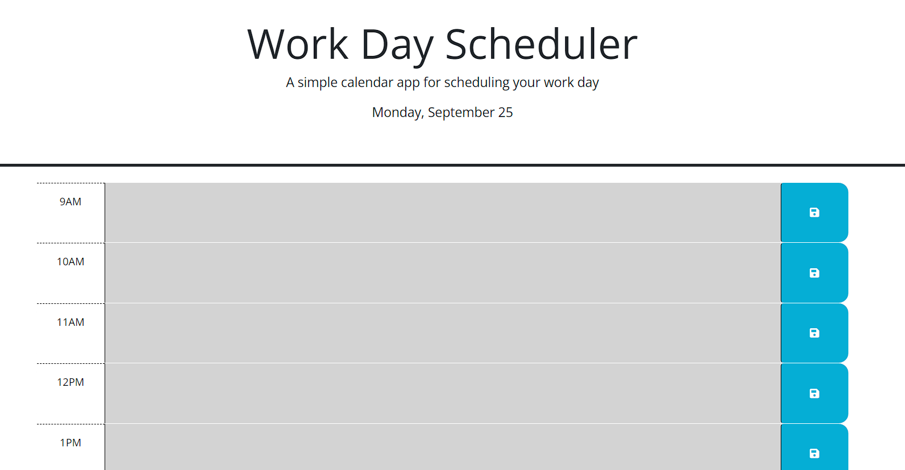

# <05 Work Day Scheduler>

## Description

This website containes a daily planner to create a schedule. When I open the planner, the current day is displayed at the top of the calendar. When I scroll down, then I am presented with time blocks for standard business hours of 9am to 5pm. When I view the time blocks for that day, then each time block is color-coded to indicate whether it is in the past, present, or future. When I click into a time block, then I can enter an event. When I click the save button for that time block, then the text for that event is saved in local storage. When I refresh the page, then the saved events persist.
## Table of Contents

- [Installation](#installation)
- [Usage](#usage)
- [Credits](#credits)
- [License](#license)
- [Features](#features)
- [How to Contribute](#how-to-contribute)
- [Tests](#tests)

## Installation

N/A

## Usage

Here is the link: https://gisellerx.github.io/challenge5-dayplanner/ 

## Credits

Giselle Reyes, and the instructor in the UM Web Development course for providing the starter code for the challenge.

## License

## Features

Website

## How to Contribute

Personal challenge

## Tests

Used VS Code